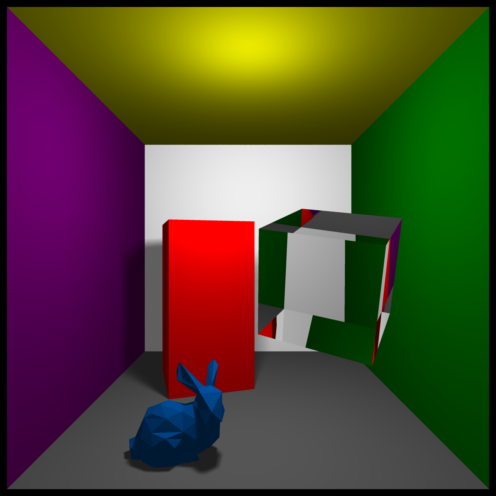
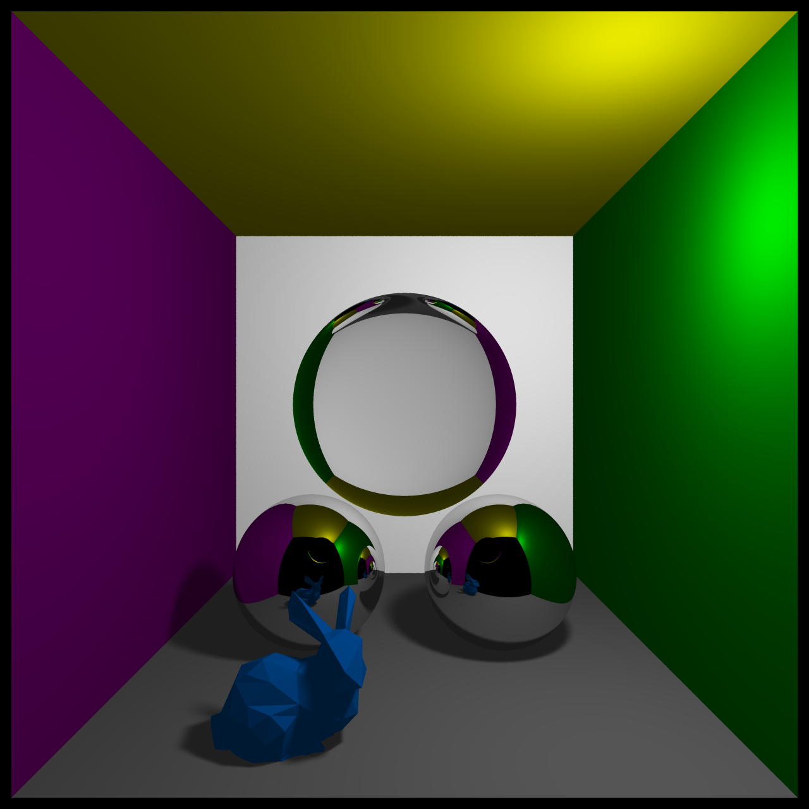

## [Computer Graphics Raytracer](https://github.com/ainsleyrutterford/UOB_Raytracer)
### Overview
This project involved building a Real-Time Raytracer from scratch using OpenCL, GLM and SDL. As can be seen in this [video](https://streamable.com/rn875), the raytracer was used to render the [Cornell Box](https://en.wikipedia.org/wiki/Cornell_box) where phenomena such as reflection and refraction have been showcased. The realism of the rendered image was improved further using anti-aliasing and soft shadows. Other Cornell Box scenes are shown in the images below:
<br>



<br>
### Technologies 
* C
* OpenCL
* OpenGL Mathematics (GLM)
* Simple DirectMedia Layer (SDL2)


### Compile and Run
```bash
git clone git@github.com:ainsleyrutterford/UOB_Raytracer
cd UOB_Raytracer
source clean_build.sh
```
Requirements: A GPU, OpenCL, GLM, and SDL2
